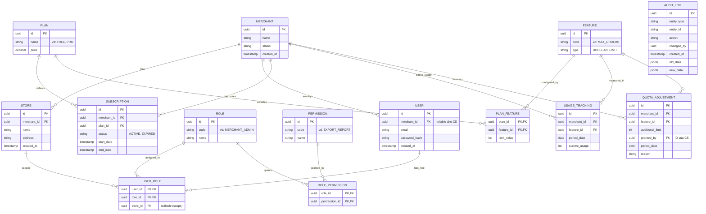

# Lược đồ Cơ sở dữ liệu Hệ thống SaaS (Database Schema)

Dưới đây là sơ đồ mô hình thực thể liên kết (ERD) và phân tích chi tiết về Primary Key (PK), Foreign Key (FK) cùng các Index quan trọng cho hệ thống SaaS Merchant đa người thuê (Multi-tenant).

## 1. Sơ đồ Thực thể - Mối quan hệ (ER Diagram)

Sơ đồ ERD sử dụng Mermaid. (Hỗ trợ tốt nhất khi bạn view bằng các công cụ như VSCode hoặc GitHub).

---

## 2. Giải thích chi tiết PK, FK và Index tối ưu

Trong hệ thống **Multi-tenant**, hiệu năng (Performance) là ưu tiên số 1 vì data của tất cả khách hàng nằm chung trên một cụm DB. Chìa khóa ở đây là **Index vào `merchant_id`**.

### Nhóm 1: Tenant & Người dùng (Core)

#### Bảng `merchants`
*   **PK:** `id` (Nên dùng UUID hoặc BIGINT để bảo mật, không dùng Auto-increment số nhỏ lộ lượng khách hàng).
*   **Index:**
    *   `idx_status`: Lọc danh sách Merchant đang hoạt động nhanh.

#### Bảng `stores`
*   **PK:** `id`
*   **FK:** `merchant_id` references `merchants(id)`
*   **Index:**
    *   `idx_merchant_id`: Cực kỳ quan trọng vì khi load data Store, ta luôn luôn query kèm `WHERE merchant_id = ?`.

#### Bảng `users`
*   **PK:** `id`
*   **FK:** `merchant_id` references `merchants(id)`
*   **Index:**
    *   `idx_email` (UNIQUE): Dùng để tăng tốc khi đăng nhập (Login) và đảm bảo không trùng email.
    *   `idx_merchant_id`: Tối ưu khi load danh sách nhân viên của 1 merchant.

### Nhóm 2: RBAC (Phân quyền)

#### Bảng `user_roles` (Bảng trung gian)
*   **PK:** `(user_id, role_id, store_id)` (Tránh một user được cấp quyền y hệt 2 lần ở cùng 1 store). (Chú ý nếu store_id null thì cần thiết kế PK hợp lý tùy SQL Engine).
*   **FK:** `user_id` -> `users(id)`, `role_id` -> `roles(id)`, `store_id` -> `stores(id)`
*   **Index:**
    *   `idx_user_id`: Khi user đăng nhập, ta sẽ query tất cả role của user này để sinh JWT token.

#### Bảng `role_permissions`
*   **PK:** `(role_id, permission_id)`
*   **FK:** `role_id` -> `roles(id)`, `permission_id` -> `permissions(id)`
*   **Index:** Dựa theo PK là đủ vì ta luôn lấy permissions qua role.

### Nhóm 3: Subscriptions & Quota (Hạn mức tính năng)

#### Bảng `subscriptions`
*   **PK:** `id`
*   **FK:** `merchant_id` -> `merchants(id)`, `plan_id` -> `plans(id)`
*   **Index:**
    *   `idx_merchant_id_status`: Để tìm xem "Merchant này đang có gói nào ACTIVE" rất nhanh.

#### Bảng `usage_tracking` (Lưu lượng sử dụng theo ngày)
*   **PK:** `id`
*   **FK:** `merchant_id` -> `merchants(id)`, `feature_id` -> `features(id)`
*   **Index:**
    *   `idx_usage_lookup` (UNIQUE trên 3 trường: `merchant_id, feature_id, period_date`): Index này rất quan trọng để tránh tạo duplicate dòng dữ liệu đếm cho cùng 1 ngày, đồng thời tăng tốc O(1) khi hệ thống check quota.

#### Bảng `quota_adjustments` (CS tăng thêm limit)
*   **PK:** `id`
*   **FK:** `merchant_id`, `feature_id`, `granted_by` (trỏ về user_id của nhân viên CS).
*   **Index:**
    *   `idx_merchant_feature_date`: Để truy xuất "Hôm nay Merchant này có được tặng thêm quota nào không?".

### Nhóm 4: Audit Log (Lịch sử chỉnh sửa)

#### Bảng `audit_logs`
*   **PK:** `id`
*   **FK:** Không nên dùng FK cứng (như trỏ về bảng orders, users) vì bảng bị xóa có thể làm lỗi logic log, và bảng logs chứa data của đa dạng thực thể (`entity_type`).
*   **Index:**
    *   `idx_entity` (`entity_type`, `entity_id`): Để người dùng click vào trang "Lịch sử chỉnh sửa" của 1 đơn hàng (Ví dụ: `WHERE entity_type = 'orders' AND entity_id = '123'`) hệ thống truy xuất cực kỳ nhanh.
    *   `idx_created_at`: Để sort lịch sử theo thời gian.
*   **Column:** `old_data`, `new_data` nên được khai báo kiểu **JSONB** (PostgreSQL). Giúp query được cả field con bên trong JSON nếu cần (ví dụ: tìm ai đã sửa trạng thái thành 'CANCELLED').
