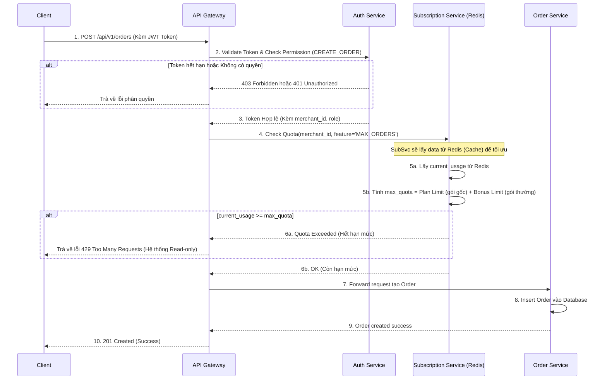
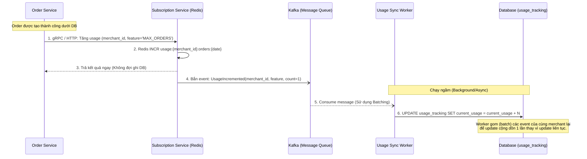

# Kiến trúc Microservices & Sequence Diagrams

Dưới đây là thiết kế chi tiết kiến trúc Microservices cho hệ thống SaaS và Flow/Sequence Diagram cho 2 luồng cực kỳ quan trọng: **Check Access (Kiểm tra phân quyền & Quota)** và **Update Usage (Cập nhật lưu lượng sử dụng)**.

## 1. Thiết kế các Microservices (Microservice Architecture)

Với bài toán lớn, hệ thống được chia thành các service độc lập để scale dễ dàng:

1.  **API Gateway**: Điểm vào duy nhất (Entry point) cho mọi request. Xử lý Rate Limiting, Authentication ban đầu và Routing.
2.  **Identity / Auth Service**: Quản lý User, Role, Permission (RBAC). Cung cấp API để xác thực và cấp JWT Token.
3.  **Tenant / Subscription Service**: Quản lý thông tin Merchant, Store, Gói cước (Plans), Hạn mức (Quotas) và các Hạn mức được thưởng/tặng (Adjustments). Service này sở hữu Redis Cache để check Quota cực nhanh.
4.  **Core Domain Services (vd: Order Service, Product Service)**: Chứa logic nghiệp vụ chính của hệ thống.
5.  **Audit Log Service**: Consume messages từ Kafka để lưu vết lịch sử mọi hành động (đã trình bày ở file trước).

---

## 2. Sequence Diagram: Flow Kiểm tra Quyền và Quota (API Check Access)

**Yêu cầu đặt ra:** Khi user gọi API, cần check xem User có quyền không, và Merchant có còn Quota không. Quota phải tính tổng của **Gói gốc (Plan Limit)** và **Gói thưởng (Bonus/Adjustment Limit)**.

**Giải thích logic tối ưu "Gói gốc và Gói thưởng" (Bước 5):**
Để không phải query DB tính toán `max_quota` = "gói gốc" + "gói thưởng" cho mỗi request gây chậm chạp, ta dùng kiến trúc **Event-Driven**:
Mỗi khi Merchant mua gói mới (gói gốc) hoặc Customer Service tặng thêm lượt (gói thưởng), hệ thống tự động tính toán tổng số này và lưu vào Redis.
Dữ liệu Redis lúc này chỉ đơn giản gồm 2 key:
- `quota:{merchant_id}:max_orders` = 1005 *(1000 từ Plan + 5 từ CS)* -> **Đã được tính toán sẵn**
- `usage:{merchant_id}:orders:2026-07-01` = 800 *(Lượng đang dùng hôm nay)*
Thuật toán check lúc này ở API Gateway/SubSvc chỉ tốn `O(1)`: Lấy 2 số từ Redis so sánh với nhau, cực kỳ trơn tru.

---

## 3. Sequence Diagram: Flow Cập nhật Lưu lượng (API Update Usage)

Sau khi Tạo đơn hàng thành công, hệ thống phải **tăng biến đếm Usage lên 1**. Nếu cộng thẳng vào DB (UPDATE current_usage = current_usage + 1) mỗi khi có đơn hàng thì sẽ dẫn tới khóa dòng (Row Lock) trên Database gây Deadlock khi có hàng ngàn đơn mỗi giây. 

Giải pháp là dùng **Redis INCR** và **Kafka (Đồng bộ ngầm)**.

**Giải thích Flow Update Usage:**
1.  **Fast Path (Đường đáp ứng nhanh cho User):** Order Service báo cho Subscription Service tăng counter. Lệnh `INCR` của Redis chạy trên memory cực nhanh (chưa tới 1ms), request kết thúc ngay lập tức. Tính realtime luôn được đảm bảo vì API Check Access (ở trên) đọc trực tiếp số đếm đang nhảy liên tục từ Redis.
2.  **Slow Path (Đường đồng bộ bền vững - Durability):** Để tránh mất data trên Redis nếu server sập, ta bắn một Event xuống Kafka. Một con Worker chạy ngầm sẽ gom (batching) các sự kiện lại. 
    *VD: Trong 5 giây có 50 đơn hàng mới của cùng Merchant A, Worker gom lại và gọi duy nhất 1 lệnh SQL: `UPDATE usage_tracking SET current_usage = current_usage + 50 WHERE merchant_id = A`.* Điều này triệt tiêu hoàn toàn Database Bottleneck.
